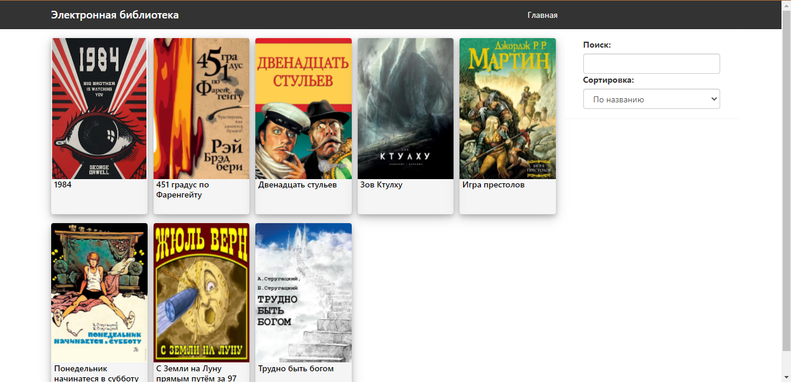
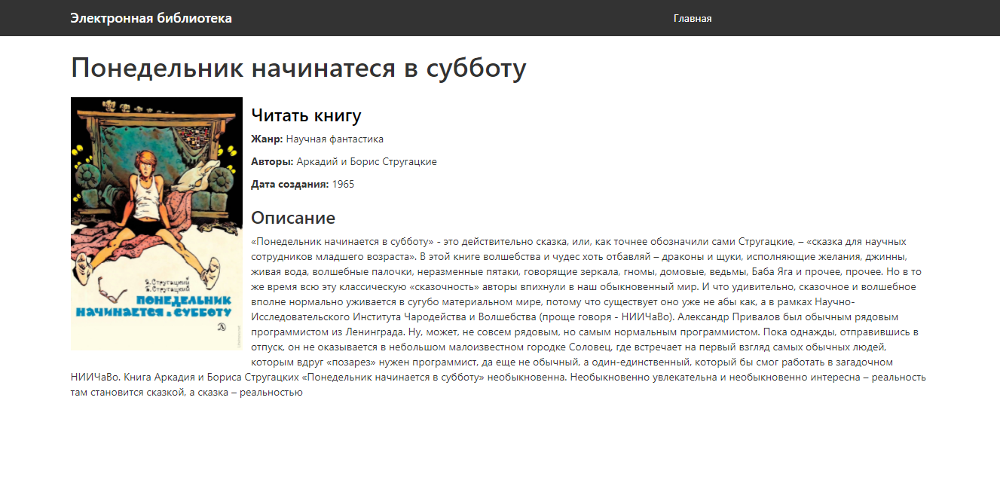
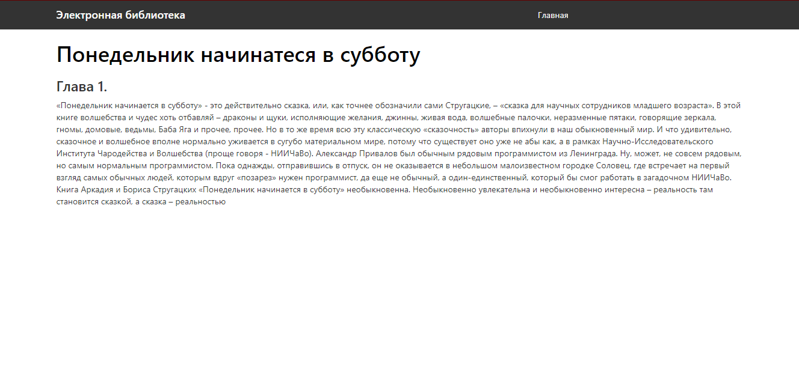

# AngularJS Book store

### Installing Dependencies
### Installing Dependencies

The application relies upon Node.js tool, such as [Bower][bower]. You can install by running:

```
npm install
```
and 
```
npm postinstall
```
This will also run Bower, which will download the Angular files needed for the current step of the
tutorial.

### Running the Application during Development

- Run `npm start`.
- Navigate your browser to [http://localhost:8000/](http://localhost:8000/) to see the application 
  running.

### layout of system:



